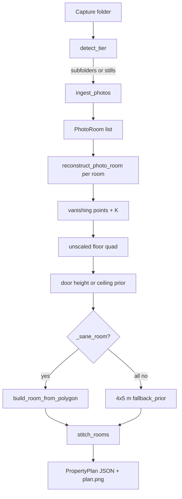

# Photo tier — plan and implementation

Increment 2. Same CLI and `RoomGeometry` contract as LiDAR. No depth, no poses, 2–8 stills per room.

---

## 1. Plan (why this design)

### Requirement (from the case study)

- Input: 2–8 stills per room, any iPhone 15+, no depth, no poses.
- Layout: **one folder per room**. Those folders must still produce one stitched whole-property plan.
- Same output as LiDAR: walls, openings, ceiling, area, confidence interval on every metric.
- Gate: wall lengths within **±8% with calibrated intervals**. Confident garbage on thin input is a score cap.
- Walk-in test runs **one command** on a folder they have never seen.

### Options we rejected

| Option | Why not |
|---|---|
| COLMAP / GLOMAP | 2–8 stills usually fail sparse SfM. Extra binary on a clean machine. |
| Metric3D / Depth Anything | Extra weights, still need scale, harder to defend live. Allowed, but not needed yet. |
| Tight numbers from one wall photo | The brief penalizes this. |

### Options we took

1. **Vanishing-point Manhattan** on the strongest still (LSD, Hough fallback).
2. **Door leaf = 2.032 m (80")** as the only metric stick. Config, not a magic number in code.
3. **Calibrated interval width** is a fraction of the value (`0.08` / `0.18` / `0.30`), not 1.5 cm.
4. **Fail wide, not silent:** degenerate reconstructions are discarded; if every still fails, emit a 4×5 m prior at 30% with `reason=fallback_prior`.
5. **Stitch without poses:** match door widths (±20%), translate rooms so AABBs do not overlap. No fake pose graph (that is the LiDAR drift row later).

### Capture protocol this plan assumes

Stock Camera app, JPEG preferred, landscape, 2–8 frames per room, a **full door leaf** in at least one frame, one subfolder per room. Written in `README.md` so a non-engineer can follow it at the defense.

---

## 2. Data flow



CLI (unchanged entrypoint):

```bash
uv run floorplan process data/raw/photos_property --out runs/photos_property
```

Folder contract:

```
photos_property/          # capture argument
  living/01.jpg … 06.jpg
  kitchen/01.jpg … 04.jpg
```

A flat folder of stills is one room named after the folder.

---

## 3. Implementation (what shipped)

### 3.1 Files

| Path | Role |
|---|---|
| [`src/floorplan/ingestion/photos.py`](../src/floorplan/ingestion/photos.py) | `PhotoCapture` / `PhotoRoom`; 2–8 stills per room |
| [`src/floorplan/ingestion/detect.py`](../src/floorplan/ingestion/detect.py) | stills or room subfolders → `photos` (after LiDAR) |
| [`src/floorplan/reconstruction/vanishing.py`](../src/floorplan/reconstruction/vanishing.py) | lines, sequential VP RANSAC, vertical assignment, focal length |
| [`src/floorplan/reconstruction/sfm.py`](../src/floorplan/reconstruction/sfm.py) | per-still reconstruct, door/ceiling scale, sanity, fallback |
| [`src/floorplan/reconstruction/scale_recovery.py`](../src/floorplan/reconstruction/scale_recovery.py) | `scale_from_door_height` |
| [`src/floorplan/reconstruction/room.py`](../src/floorplan/reconstruction/room.py) | `build_room_from_polygon` → same `RoomGeometry` |
| [`src/floorplan/confidence/scoring.py`](../src/floorplan/confidence/scoring.py) | `interval_calibrated` (fractional half-width, `lo` clamped at 0) |
| [`src/floorplan/stitching/adjacency.py`](../src/floorplan/stitching/adjacency.py) | door-width adjacency |
| [`src/floorplan/stitching/multi_room.py`](../src/floorplan/stitching/multi_room.py) | pack / no-overlap stitch |
| [`src/floorplan/pipeline.py`](../src/floorplan/pipeline.py) | `_process_photos` |
| [`configs/default.yaml`](../configs/default.yaml) | all photo thresholds |
| [`scripts/extract_photo_proxy.py`](../scripts/extract_photo_proxy.py) | rip stills from `rgb.mp4` for local debug only |
| [`tests/ingestion/test_photos.py`](../tests/ingestion/test_photos.py) | detect + ingest |
| [`tests/reconstruction/test_photos.py`](../tests/reconstruction/test_photos.py) | synthetic room, stitch, proxy |

Video reconstruction is increment 3 (see [`video_tier_plan.md`](video_tier_plan.md)).

### 3.2 Ingest

- Image suffixes: `.jpg .jpeg .png .heic .webp .tif .tiff`.
- Nested room folders win over a flat dump.
- `max_use_images: 8` — extras are dropped with a warning.
- Fewer than `min_images: 2` is allowed to run; intervals stay wide (logged).

Detection order: LiDAR (`odometry.csv` + `depth/`) first, then photos, then video. A leftover `.mp4` next to stills does not steal the photo path.

### 3.3 Per-still reconstruction

1. **Lines.** OpenCV LSD if present; else Canny + `HoughLinesP` (`line_min_length_px: 40`).
2. **Three vanishing points.** Seeded sequential RANSAC on line intersections (`vp_iterations: 250`, `vp_inlier_px: 4`).
3. **Vertical VP.** Family whose segments are most image-vertical, with a weak preference for a VP near image-center x.
4. **Focal length.** Two orthogonal VPs: \(f^2 = -(\mathbf{v}_a-\mathbf{p})\cdot(\mathbf{v}_b-\mathbf{p})\). Fallback: `max(w, h)`.
5. **Unscaled floor quad.** Horizontal VP families → two extreme lines each → intersect → back-project onto `up · X + 1 = 0` → 2D polygon in the floor basis.
6. **Scale (first that is sane):**
   - Door pair (near-vertical segments, aspect ~1.6–4.5, gap 20–220 px) → `s = 2.032 / h_unscaled`. Reason: `door_height_2.032m`.
   - Else longest vertical span → `s = 2.4 / h_unscaled`. Reason: `ceiling_prior_no_door`.
7. **Ceiling.** Default 2.4 m. If a long vertical, after door scale, lands in `[1.8, 4.0]`, use that and tag `ceiling_from_vertical_span`.
8. **Sanity (`_sane_room`).** Edges in `[0.6, 18]` m, area in `[2, 80]` m², aspect ≥ 0.2, ceiling in `[1.7, 4.2]`. Fail → skip that still.
9. **Pick** the sane still with the highest score (VP inliers + 50 if a door fired).
10. **If none sane:** 4×5 m box, ceiling 2.4 m, reason `fallback_prior`, warning `manhattan_vp_failed`.

Door opening on the output: typical 0.9 m leaf parked on the longest wall, ±8% interval. Position is not triangulated — do not defend it as a measured jamb. See the opening-gate judgment call in §6 and the compliance matrix.

### 3.4 Confidence (the thing that is scored)

| Scale reason | Half-width fraction | Config key |
|---|---|---|
| `door_height_2.032m` | 8% | `photos.door_scale_frac` |
| `ceiling_prior_no_door` | 18% | `photos.prior_scale_frac` |
| `fallback_prior` | 30% | `photos.failed_scale_frac` |

Area uses `2 ×` that fraction. This is the “calibrated intervals” claim: the photo gate is ±8%, so a door-scaled wall reports about that width, not a LiDAR-style 1.5 cm.

### 3.5 Multi-room stitch

- Each subfolder → one `RoomGeometry` in its own frame.
- `infer_adjacencies`: pair rooms if both have a `door` whose widths differ by ≤ 20%.
- `stitch_rooms`: first room at origin; matched rooms sit to the right of their partner; unmatched rooms pack in a row (+0.4 m gap). Overlaps are pushed apart.
- No shared-pose drift correction. Warning `photo_stitch_unmatched_doors` if two or more rooms and zero door matches.

### 3.6 Config (live-defense targets)

All in [`configs/default.yaml`](../configs/default.yaml) under `photos:`

- `door_height_m: 2.032` — “why 80 inches?”
- `ceiling_prior_m: 2.4`
- `door_scale_frac: 0.08` — “why ±8%?”
- `fallback_width_m` / `fallback_depth_m` — the prior box

---

## 4. Tests and what they actually prove

| Test | Proves |
|---|---|
| `test_detect_flat_photo_folder` / `test_detect_per_room_folders` | Tier detect + ingest tree |
| `test_photo_pipeline_synthetic_room` | Drawn box + door → `PropertyPlan`, ≥3 walls, interval ≥ ~8% |
| `test_multi_room_photo_folders_do_not_overlap` | Two room folders → two rooms, AABBs disjoint |
| `test_stitch_resolves_overlap` | Door-matched boxes get an adjacency and no overlap |
| `test_photo_proxy_from_lidar_video` | Vendor `rgb.mp4` stills still produce valid JSON (usually `fallback_prior`) |

Full suite: 13 tests, including existing LiDAR stage tests.

**Not proven:** accuracy against tape on a real iPhone still set. That is the benchmark increment, after we capture our own rooms.

---

## 5. Observed behavior (already run)

- Synthetic interior (tests): path completes, schema validates.
- Six stills ripped from `data/raw/single_room/rgb.mp4`: every frame failed VP/sanity; output was `fallback_prior`, 4×5 m, 2.4 m ceiling, 30% interval. Correct for non-protocol frames (blur, no composed door).
- Those ripped stills live in `data/raw/single_room_photos/` and are **gitignored** (derived from vendor video, not our capture).

---

## 6. Honest limits (say this in the defense)

- One strong still drives the room, not a fused multi-view model.
- Door height is a **standard**, not the leaf we taped, until we measure our own doors.
- Opening *position* on the wall is a placeholder; width interval is the honest part.
- **Opening-width gate (judgment call).** Spec: ≤ 2 cm on ≥ 85% of openings, missed/phantom scored. Walls get an explicit photo exception (±8%); the opening row does not. We assume opening accuracy scales with tier confidence and is **not** independently gated at 2 cm on the photo path. If they meant (a) 2 cm at every tier, this row fails on photos until we tape doors and detect jambs. Flagged in the compliance matrix. Ask Siva if possible; do not build jamb localization this increment.
- Stitch adjacency is door-width matching, not visual overlap or a pose graph.
- HEIC works only if Pillow can decode it; protocol says export JPEG.

---

## 7. What this increment did not do

Video reconstruction, LiDAR multi-room drift ablation, damage / concealed rules, our own photo captures + ground truth, incumbent head-to-head, fix loop.

Next useful work: shoot the protocol on a real room (door in frame), tape the walls, run the same command, and see whether door-scale intervals cover the tape. That is the photo-tier benchmark, not more VP polish.
