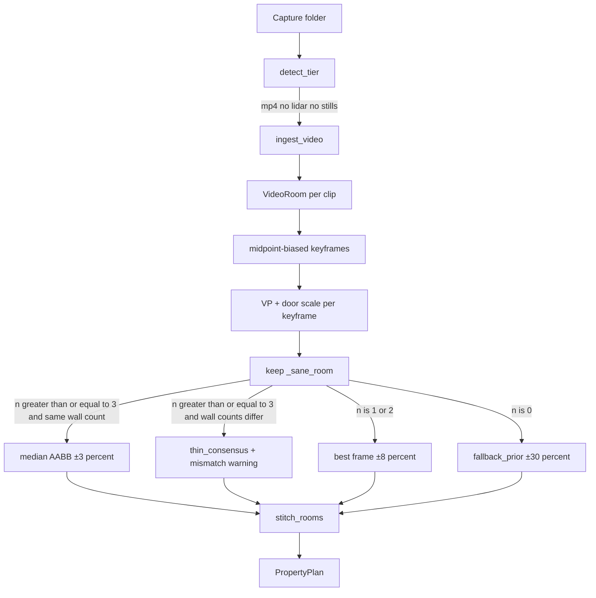

# Video tier — plan and implementation

Increment 3 design notes (historical). **Current run book:** [`README.md`](../README.md). Gate claim ±3% on consensus only — our kitchen/bedroom walks so far are thin/fallback; do not treat ±3% as proven on in-repo clips.

---

## 1. Requirement

- Input: a handheld walkthrough from any iPhone 15+ (stock Camera).
- Same output contract: walls, openings, ceiling, area, `ConfidenceInterval` on every metric.
- Video walls: ±3% with calibrated intervals.
- Opening-width 2 cm row: same judgment call as photos (not independently gated at video unless Siva says otherwise). Document, do not build jambs.
- One command: `uv run floorplan process <folder> --out <dir>`.
- Walk-in can pick this tier on the day.

---

## 2. Decisions

### Capture layout — one clip per room

The brief says “a handheld walkthrough clip,” singular. A single property-length clip would need room segmentation (hard, easy to get wrong). We already have per-room folders for photos.

**Protocol:** one `.mp4` / `.mov` per room, same tree as photos.

```
videos_property/
  living/walk.mp4
  kitchen/walk.mp4
```

A single `walk.mp4` at the top level is one room. LiDAR folders stay LiDAR (`odometry.csv` + `depth/` win, even if `rgb.mp4` is present).

Walk 20–40 s per room, slow, include a full door leaf, landscape, no zoom. Export the file via Files/AirDrop (HEVC is fine if OpenCV can decode; if not, protocol says “Most Compatible” / H.264).

### Reconstruction — not COLMAP, not photo-on-one-frame

| Option | Verdict |
|---|---|
| COLMAP on extracted frames | Reject for the same reasons as photos, plus install time. Revisit only if this increment fails the ±3% story on a real clip. |
| Run current photo VP on one mid-clip frame | Too weak for ±3%. Video’s advantage is **many** views. |
| Full monocular SLAM / ORB-SLAM | Over-scope. |
| **Keyframe sample + per-frame photo recon + consensus** | Shipped. Reuses increment 2. More stills → median AABB, tighter interval. |

**Algorithm (shipped):**

1. Ingest clips; sample `N` keyframes (config, default 16). Skip first/last 10%. **Midpoint-biased** (Beta 2.2, 2.2), not even in time — walkthroughs often start on a doorway; the walker is more often centered mid-clip.
2. Run increment-2 VP + door-scale per keyframe via `reconstruct_from_bgr` (in-memory, no JPEG dump).
3. Keep only `_sane_room` results.
4. `consensus_mode` is an explicit branch, not an assumed invariant:
   - ≥ `min_sane_frames` (3) **and** every sane frame has the **same wall count** → median AABB width/depth, reason `video_keyframe_consensus`, fraction **0.03**.
   - Wall counts disagree → **never** attempt a mismatched median. Drop to `video_thin_consensus` and warn `video_wall_count_mismatch`.
   - 1–2 sane frames (same or not): best score, fraction **0.08**, warning `video_thin_consensus`.
5. Zero sane: 4×5 m `fallback_prior` at 30%. Never invent a tight 3%.

Median is width/depth AABB, not vertex-index. Canonicalizing winding + start vertex + Manhattan heading is the quietly hard part; we refused the silent-garbage path.

Scale stays **door height 2.032 m** / ceiling prior — video has no metric depth either.

### Stitch

Reuse `stitch_rooms` / door-width adjacency. No new pose graph. Video does not satisfy the LiDAR drift-ablation row.

### Openings

Same photo judgment call: no 2 cm gate claimed at this tier; placeholder leaf if a door fired on a keyframe. Do not build jamb localization.

---

## 3. What shipped

| Path | Change |
|---|---|
| `ingestion/video.py` | `VideoCapture` / `VideoRoom` (one clip per room). |
| `ingestion/detect.py` | Per-room folders with `*.mp4`/`*.mov` (and no stills) → `video`. LiDAR still wins first. |
| `reconstruction/video.py` | Midpoint-biased sample + `consensus_mode` + AABB median. |
| `reconstruction/sfm.py` | `reconstruct_from_bgr` so keyframes stay in memory. |
| `pipeline.py` | `_process_video` → `RoomGeometry` list → `stitch_rooms(..., tier="video")`. |
| `configs/default.yaml` | `video:` block (counts, fracs, skip ends, `midpoint_bias`). |
| `tests/ingestion/test_video.py` | Nested clips vs LiDAR `rgb.mp4`. |
| `tests/reconstruction/test_video.py` | Synthetic clip → consensus; blur clip → not 3%; wall-count mismatch → thin. |
| `README.md` | Video protocol + device matrix. |

HEVC failure logs `ERROR` with the H.264 protocol line. Do not commit ripped vendor `rgb.mp4` frames.

---

## 4. Pipeline



---

## 5. Config (live)

```yaml
video:
  keyframe_count: 16
  skip_start_frac: 0.10
  skip_end_frac: 0.10
  min_sane_frames: 3
  consensus_frac: 0.03
  thin_frac: 0.08
  midpoint_bias: true
  # reuse photos.door_height_m / ceiling_prior / fallback box
```

---

## 6. Tests (lean)

- Detect: `living/walk.mp4` + `kitchen/walk.mp4` → video, two rooms; LiDAR folder with `rgb.mp4` still lidar.
- Synthetic mp4 of the drawn interior, identical frames → sane consensus, ±3% interval, `video_keyframe_consensus`.
- Blur-only clip → fallback or thin path, interval **not** 0.03.
- `consensus_mode`: mismatched wall counts → `thin`, never `consensus`.
- Schema validate on CLI output.

Skip COLMAP golden tests. Skip vendor-lidar-video as a “good” video (those stills fail VP). Own protocol clips are not shot yet.

**First real-data check (vendor `rgb.mp4` as a video-only folder, 8 mid-biased keyframes):** 7 frames failed `_sane_room` / VP, 1 barely passed → `video_thin_consensus` ±8%. Consensus never fired. Matches the coverage warning: do not debug the median until we have a protocol walkthrough.

---

## 7. Deliberately out of this increment

- COLMAP / ORB-SLAM.
- Whole-property single-clip room splitting.
- Opening jambs / 2 cm photo-video opening gate (judgment call stands).
- IMU (stock Camera export has none).
- Drift ablation (LiDAR multi-room).
- Damage.

---

## 8. Defense lines

- “Video is many photo reconstructions with a median, not SLAM.”
- “±3% only when ≥3 keyframes agree on wall count; otherwise we widen to photo or prior.”
- “If wall counts disagree we drop to thin_consensus — we do not median mismatched polygons.”
- “Scale is still the door. The extra frames buy repeatability, not metric depth.”
- “One clip per room is the protocol so we do not invent room cuts.”
- “If consensus rarely fires on a real walkthrough, fix sampling (mid-clip bias), not VP.”

---

## 9. Done when

- `uv run floorplan process <video_folder> --out …` writes `plan.json` + `plan.png`.
- Nested clips stitch without overlap.
- Tests above pass.
- README protocol + device matrix list video as ready.
- Technical report increment 3 written as we go.
- No COLMAP, no opening-position work.
